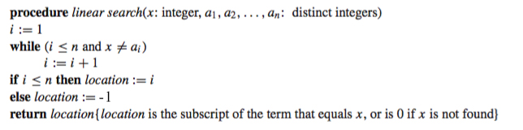
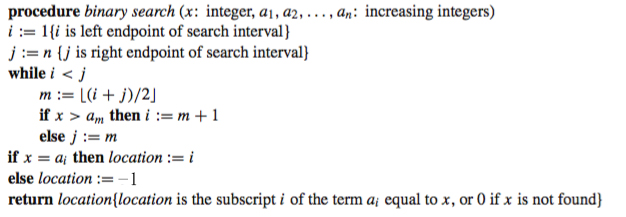
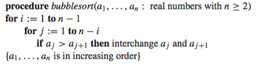
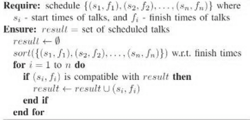
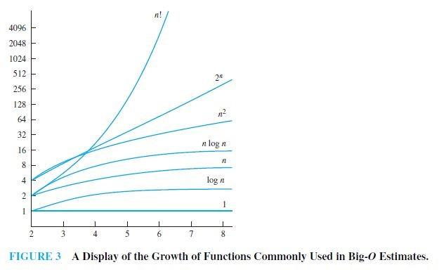
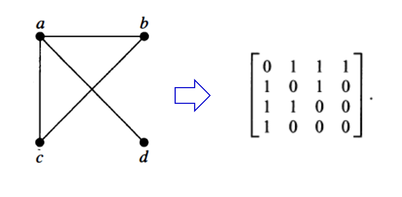

# dismathportfolio-vittorionavarro
##Week 1
**Proposition** - is a statement which can be either true or false, but cannot be both.

| Logical Symbol  |  Logical Operator | Shorthand | Formula | Logical Expression |
| :-----: |:-------:|:-----:| :-------: | :-------: |
| ¬ |Negation | not | (¬p) = 1 - (p) | ¬p |
| ∧ | Conjunction | and | (p ∧ q) = min((p), (q)) | p ∧ q |
| v | Disjunction | or | (p v q) = max(p), (q)) | p v q |
| ⊕ | Exclusive disjunction | xor | if (p)  not equal (q) = 1 , otherwise  0|  p ⊕ q  ≡ (¬p ∧ q) v (p ∧ ¬q) |
| → | Conditional | if, then | if (p)  ≤ (q) = 1 , otherwise  0  | p → q ≡  ¬p v q |
| ↔ | Biconditional | iff | if (p) equals (q) = 1 , otherwise  0 |  p ↔ q ≡ (p → q) ∧ (q → p) |

* I also learned proving by using a truth table.

##Week 2

|                           Equivalence                           |         Name        |
|:-------------------------------------------------------------:  |:-------------------:|
|                      p ∧ T ≡ p   p v F ≡ p                   |    Identity laws    |
|                       p v T ≡ T   p ∧ F ≡ F                  |   Domination laws   |
|                       p v p ≡ p   p ∧ p ≡ p                  |   Idempotent laws   |
|                            ¬(¬p) ≡ p                            | Double negation law |
|                   p v q ≡ q v p   p ∧ q ≡ q ∧ p              |   Commutative laws  |
|       (p v q) v r ≡ p v (q v r)   (p ∧ q) ∧ r ≡ p ∧ (q ∧ r)  |   Associative laws  |
| p v (q ∧ r) ≡ (p v q) ∧ (p v r)    p ∧(q v r) ≡ (p ∧ q) v (p ∧ r) |  Distributive laws  |
|              ¬(p ∧ q) ≡ ¬p v ¬q   ¬(p v q) ≡ ¬p ∧ ¬q          |   De Morgan's laws  |
|                 p v (p ∧ q) ≡ p   p ∧ (p v q) ≡ p             |   Absorption laws   |
|                     p v ¬p ≡ T   p ∧ ¬p ≡ F                   |    Negation laws    |

- **Quantifiers**
	- *Existential Quantifiers* (∀) - indiciates "there exists"
	- *Universal Quantifiers* (∃) - indicates "for all"

##Week 3
- **Tautology** - proposition that is always true.
- **Fallacy** - an invalid argument.
- Validifying arguments using truth tables takes time, therefore, *rules of inference* can be an alternative because it makes it simpler. The rules of inference are as follows:

|   Rule of Inference       |            Tautology           |          Name          |
|:--------------------:     |:------------------------------:|:----------------------:|
|       p p→q ∴q      |        (p ∧ (p → q)) → q       |      Modus ponens      |
|     ¬q p→q ∴ ¬p     |       (¬q ∧ (p → q)) → ¬p      |      Modus tollens     |
|     p→q q→r ∴p→r    |  ((p → q) ∧ (q → r)) → (p → r) | Hypothetical syllogism |
|      p∨q ¬p ∴q      |       ((p ∨ q) ∧ ¬p) → q       |  Disjunctive syllogism |
|       p ∴p ∨ q         |           p → (p ∨ q)          |        Addition        |
|       p ∧ q ∴p         |           (p ∧ q) → p          |      Simplication      |
|      p q ∴p ∧ q     |      ((p) ∧ (q)) → (p ∧ q)     |       Conjunction      |
| p ∨ q ¬p ∨ r ∴q ∨ r | ((p ∨ q) ∧ (¬p ∨ r)) → (q ∨ r) |       Resolution       |

- **Introduction to Proof**
	- **Proof** - is a valid argument that establishes the truth to a theorem.
- **Methods of Proof**
  1. Direct Proof
  2. Proof by Contraposition (Indirect)
  3. Vacuous and Trivial Proofs
  4. Proof by Contradiction (Indirect)
  5. Proof by Equivalence
  6. Mathematical Induction
  
##Week 4

- *Continuation of Proof*
	1. **Direct Proof** (P → Q): 
  - Steps in constructing Direct Proof:
    1. Assume that P (hypothesis) is true.
    2. Use P to show that Q (conclusion) must be true.
    	2. **Proof by Contraposition** (¬Q → ¬P): 
  - Steps in constructing Contrapositive Proof:
    1. Assume that ¬Q is true.
    2. Show that ¬P is also true.
    	3. **Vacuous & Trivial Proofs**: 
  - Vacuous Proof: It is a proof that P → Q is true based on the fact that P is false.
    - ¬P → (P → Q)
    	4. **Proof by Contradiction**:
  - Steps in constructing Proof by Contradiction:
    1. Assume P is true.
    2. Assume ¬Q is true.
    3. Demonstrate a contradiction.

##Week 5
- *Continuation of Methods of Proof*

##Week 8
**Algorithms** 
  - is a finite set of precise instructions
	- **Properties of Algorithm:**
	  * INPUT
	  * OUTPUT
	  * DEFINITENESS
	  * CORRECTNESS
	  * FINITENESS
	  * GENERALITY
	  * EFFECTIVENESS
	  
**Pseudocode** - is a high-level desciption of an algorithm that uses the structural conventions of programming knowledge.
- **Searching Algorithms**
  - Linear Search  
   
  - Binary Search  
   

##Week 9
- **Sorting Algorithms**
  - Bubble Sort  
   
  - Insertion Sort  
  
  - Greedy Algorithm  
  

##Week 10
**Growth of Functions**
  * Using Big-O, Big-Ω,and Big-ϴ
    - Big-O, upper bound
    - Big-Ω, lower bound
    - Big-ϴ, both upper and lower bound  
    

**Algorithm Time Complexity**
	
| Complexity  |   Terminology  |
|:-----------:|:--------------:|
| (1) | Constant  complexity  |
| (log n) | Logarithmic complexity |
| (n) | Linear complexity |
| (n^b) | Polynomial complexity |
| (b^n), where b > 1 | Exponential complexity |
| (n!) | Factorial complexity |

**Division and Modulo Operator**
  - Let a be an integer and d positive integer. Then there is a unique Q and r with 0 ≤ r < d such that a = dQ + r.
  	- Q = a div d
	- r = a mod d

##Week 11
*No classes due to holy week*

##Week 12
**Graph Theory**
  - **Graphs** - discrete structures consisting of vertices and edges that connect these vertices.  
  	- **Degree** - is the number of edges incident with it. A loop in a vertex contributes twice.
		- Isolated - is a vertex of degree zero.
		- Pendant - is a vertex of degree one.
  - **Handshake Theory** : 2e = ∑deg(v)
  - *Subgraphs*  
  ![Screenshot] (subgraph.jpg)
  - *Unions*  
  ![Screenshot] (union.jpg)

  - **Path** - a sequence of edges travelling from vertex to vertex along the edges.
  - **Eulerian**
    - Euler Circuit - passes through every edge and goes back to the starting point. Has even number of degrees.
    - Euler Path - passes through every edge but does not go back to the starting point. Has exactly 2 odd degrees.
  - **Hamiltonian**
    - Hamilton Circuit - passes through every nodes and goes back to the starting point.
    - Hamilton Path - passes through every nodes but does not go back to the starting point.
  - **Matrices of Graphs** - connected is 1; not connected is 0  
  

  - **Isomorphism of Graphs** - The graphs are isomorphic if there exists a one-to-one and onto function.
  - **Planar Graphs** - graphs that can be drawn in the plane without the edges crossing each other.
  - **Euler's Formula** : r = e - v + 2
	- r - regions
	- e - edges 
	- v - vertices
  - **Kuratowski's Theorem** - a graph is nonplanar if and only if it contains a subgraph homeomorphic to K3,3 or K5.

##Week 13
- *Continuation of Graph Theory*
	- **Graph Coloring**: assignment of a color to each vertex of the graph so that no two adjacent vertices are assigned the same color.
	- The *Chromatic Number* (χ) of a graph is the least number of colors needed for graph coloring.
	- **Four Color Theorem**: χ of a planar graph is not greater than 4.
- **Trees** - a connected undirected graph with no simple circuits
	- A **rooted tree** is a tree in which one vertex has been designated as the root and every edge is directed away from the root.
		- **ancestors** - nodes on top
		- **descendants** - children/grandchildren
		- **leaves** - nodes that do not have children
	- **M-ary tree**: A rooted tree is called an m-ary tree if every internal vertex has no more than m children.
	- **Properties of Trees**
		- A tree with n vertices has n − 1 edges.
		- A full m-ary tree with i internal vertices contains n = mi + 1 vertices.
		- A full m-ary tree with
			- n vertices has i = (n − 1)/m internal vertices and l = [(m − 1)n + 1]/m leaves
			- i internal vertices has n = mi + 1 vertices and l = (m − 1)i + 1 leaves
			- l leaves has n = (ml − 1)/(m − 1) vertices and i = (l − 1)/(m − 1) internal vertices.

##Week 14
**Finals Week**
