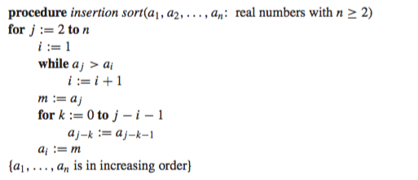

# dismathportfolio-vittorionavarro

##Week 8
**Algorithms** 
  - Is a finite set of precise instructions
	- **Properties of Algorithm:**
	  * INPUT
	  * OUTPUT
	  * DEFINITENESS
	  * CORRECTNESS
	  * FINITENESS
	  * GENERALITY
	  * EFFECTIVENESS
	  
**Pseudocode** Is a high-level desciption of an algorithm that uses the structural conventions of programming knowledge
**Finding the Max**
**Finding the Min**
**Linear Search**  

**Binary Search**  

##Week 9
**Bubble Sort**  

**Insert Sort**  

**Greedy Algorithm**

##Week 10
**Growth of Functions
  * Using Big-O, Big-Ω,and Big-ϴ
    - Big-O, upper bound
    - Big-Ω, lower bound
    - Big-ϴ, both upper and lower bound

**Algorithm Time Complexity**
**Division and Modulo Operator**
  - Let a be an integer and d positive integer. Then there is a unique Q and r with 0 ≤ r < d such that a = dQ + r.
  - Q = a div d
  - r = a mod d

##Week 12
**Graph Theory**
  **Graphs** - discrete structures consisting of vertices and edges that connect these vertices.  
  **Degree** - is the number of edges incident with it. A loop in a vertex contributes twice.
  **Isolated** - is a vertex of degree zero.
  **Pendant** - is a vertex of degree one.
  **Handshaking Theory** - 2e = ∑deg(v)
  **Subgraphs**
  ![Screenshot] (subgraph.jpg)
  **Unions**
  ![Screenshot] (union.jpg)

  **Path** - sequence of edges travelling from vertex to vertex along the edges.
  **Eulerian**
    - Euler Circuit - passes through every edge and goes back to the starting point. Has even number of degrees.
    - Euler Path - passes through every edge but does not go back to the starting point. Has exactly 2 odd degrees.
  **Hamiltonian**
    - Hamilton Circuit - passes through every nodes and goes back to the starting point.
    - Hamilton Path - passes through every nodes but does not go back to the starting point.
  **Matrices of Graphs** - connected is 1; not connected is 0
  

  **Isomorphism of Graphs** - The graphs are isomorphic if there exists a one-to-one and onto function.
  **Planar Graphs** - graphs that can be drawn in the plane without the edges crossing each other.
    - Euler's Formula - r = e - v + 2
    	- r - regions
			- e - edges
			- v - vertices 
